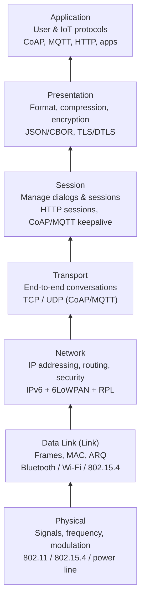
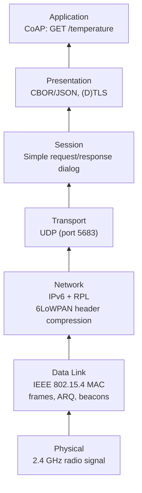
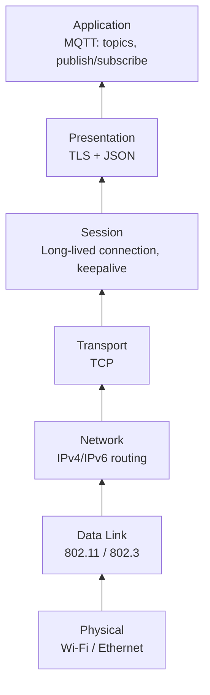
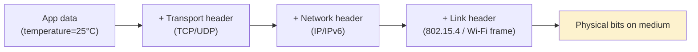
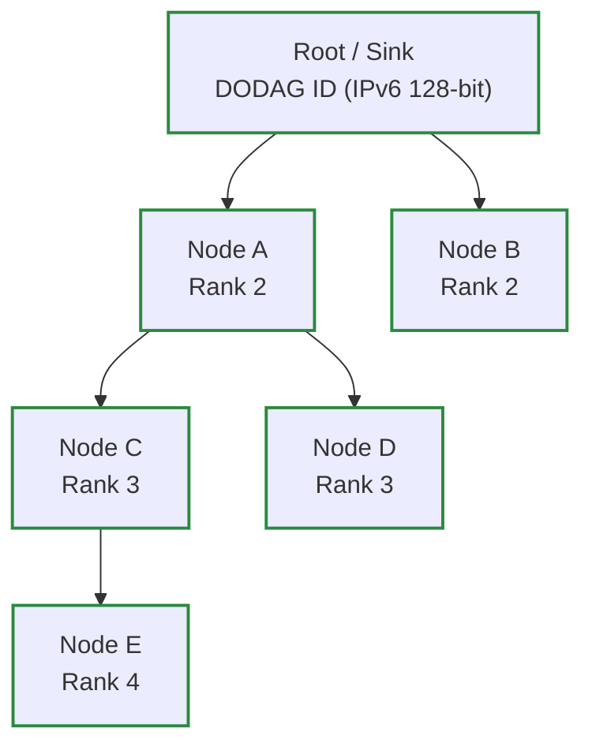

### Big picture: OSI as “how a sensor talks to an app”

Read bottom → top as: **Physics → Local Radio Rules → Internet Addressing → End‑to‑End Talk → Conversation → Meaning → App**.

I’ll go layer by layer, always with:

- **What it does**
- **How it works (IoT focus)**
- **Things to name in an exam**
- **Memory hook**

---

## 1. Physical Layer (Layer 1) – “Signals and Hardware”

### What it does

- **Turns bits into actual signals** on a medium:
  - Radio waves, voltages on a cable, power line signals, etc.
- Handles **frequencies, power, modulation, timing** – all the “analog” stuff.

### How it works in IoT

- Implemented in **radio hardware / DSP chips**; you normally **cannot change it in software** (except with software‑defined radio).
- Typical parameters:
  - **Operating frequency + bandwidth**
    - Example: **2.4 GHz** or **5 GHz** for Wi‑Fi; 2.4 GHz for many 802.15.4 radios.
  - **Constellation & encoding**
    - QPSK, QAM, etc. map bits to signal shapes.
  - **Forward Error Correction (FEC)**
    - Adds extra bits to **detect and correct errors** from noise.
  - **Signal shaping, timing, synchronization**
    - Keeps signals smooth and synchronized so the receiver can decode them.

### Things to say in an exam

- “The Physical layer does **actual communication over a physical medium** and is implemented in **hardware** (DSP, RF). It defines **frequency, bandwidth, modulation, FEC, timing and synchronization**.”

### Memory hook

- **P = Physics**: all the physics of the signal live here.

---

## 2. Data Link / Link Layer (Layer 2) – “Local Delivery & MAC”

### What it does

- Provides **reliable communication between directly connected nodes** (one hop).
- Breaks the bit stream into **frames** and adds **MAC addresses**.
- Contains the **Media Access Control (MAC)** sublayer:
  - Decides **who can talk when** on a shared medium.
- Uses mechanisms like **ARQ (Automatic Repeat reQuest)**:
  - Retransmit if a frame is lost/corrupted.

### How it works in IoT

- Very tightly coupled with the **Physical layer** in radio chips.
- Responsibilities:
  - **Within one transmission range**: ensure frames get from node A to B.
  - Handle **interference and collisions** on the channel.
  - Often supports **sleep schedules** to save power.

**Common IoT link technologies:**

- **Bluetooth**
  - **Popular, low energy, low cost**, a few Mbps.
  - Short‑range: wearables, beacons, phone → device.
- **Wi‑Fi (IEEE 802.11)**
  - **High speed (> Gbps)**, higher energy and cost.
  - Good for mains‑powered devices (cameras, routers, laptops).
- **X10 (power line)**
  - Communicates over **power cables**.
  - **Very slow (~kbps)**, but cheap and uses existing wiring.
- **IEEE 802.15.4**
  - Designed for **low‑power WSNs**, **< 1 Mbps**, low cost.
  - Basis for **ZigBee**, **6LoWPAN**, **Thread**, etc.

**IEEE 802.15.4 specifics (important IoT exam points):**

- Uses **time division** (slots/superframes):
  - Devices **sleep until their slot** → big **energy savings**.
- **Beacon‑enabled mode**:
  - Coordinator sends **beacons** that define superframes; nodes know when to wake.
- **Beacon frequency and duty cycle adjustable**:
  - Trade‑off between **delay** and **energy**.
- Runs at **2.4 GHz** (with Wi‑Fi, BT, others) → risk of **interference**, mitigated with **channel choice / frequency hopping**.
- Supports **multi‑hop**, but needs higher layers for routing and handshakes.
- **How slots are scheduled is not fully standardized** → open research topic.

### Things to say in an exam

- “Link layer gives **reliable single‑hop communication**, includes **MAC**, deals with **interference** and uses **ARQ**. In IoT, technologies like **Bluetooth, Wi‑Fi, X10, and especially IEEE 802.15.4** operate here. 802.15.4 uses **time division and beacons** to save energy.”

### Memory hook

- **L = Local**: local frames between neighbors, local MAC rules.

---

## 3. Network Layer (Layer 3) – “Addresses & Routing”

### What it does

- Manages **many nodes over many networks**.
- Provides **logical addressing** (IP addresses) and **routing** across hops.
- Can add **security** at the IP level (e.g., **IPsec**).

### How it works in IoT

- Main protocol: **IP**, especially **IPv6** (huge address space for billions of devices).
- But standard IPv6 is **too heavy** for tiny frames like 802.15.4, so we use **6LoWPAN** and **RPL**.

**6LoWPAN – IPv6 over Low‑Power WPAN**

- Problem:
  - IPv6 header = **40 bytes**, 802.15.4 frames are small.
- Observation:
  - Most traffic has **repeated fields** (same prefix, ports, etc.).
- Solution:
  - **6LoWPAN compresses IPv6 headers** from 40 bytes to as little as **2 bytes** (stateless).
  - Adds **fragmentation/reassembly** support.
  - Makes **IP on WSNs possible**.
- Key RFCs: **4944, 6282, 6775**.

**RPL – Routing Protocol for Low‑Power and Lossy Networks**

- Designed for **LLNs** (high packet loss, battery‑powered nodes).
- **Distance‑vector routing protocol**.
- Mainly used with **IPv6**, builds **DODAGs**:
  - **Destination Oriented Directed Acyclic Graphs** rooted at a **sink/root**.
- Optimized for **upward traffic** (sensors → sink).
- Supports:
  - **Multiple DODAGs / instances**
  - **Mobility** (as lossy links)
  - **Storing** vs **non‑storing** modes.

**Key RPL concepts (short versions):**

- **DAG / DODAG**: tree‑like graph with **no cycles**, all nodes want to reach the **root**.
- **Rank**: number/metric showing **how far from the root** a node is.
- **Objective Function (OF)**: formula that decides if a parent is “better” (e.g., fewer hops, better link, more energy).
- **Storing mode**: nodes keep **routing tables** for their sub‑tree.
- **Non‑storing mode**: only the **root** keeps full routing; others remember just **parents** (saves RAM).
- **Control messages**:
  - **DIS** – ask if any DODAG exists.
  - **DIO** – advertise DODAG from root down.
  - **DAO** – child asks to join / advertises reachability up.
  - **DAO‑ACK** – reply to DAO.
  - **CC** – consistency check.

### Things to say in an exam

- “The Network layer provides **IP addressing, routing and security (IPsec)**. In IoT, **6LoWPAN** compresses IPv6 headers for 802.15.4 and **RPL** builds DODAGs to route in low‑power, lossy IPv6 networks.”

### Memory hook

- **N = Navigation**: finding a path across networks (addresses + routes).

---

## 4. Transport Layer (Layer 4) – “End‑to‑End Conversations”

### What it does

- Manages **end‑to‑end communication** between processes (apps) on different hosts.
- Provides:
  - **Segmentation & reassembly** (big data → segments → big data).
  - **Reliability** (ACKs, retransmissions).
  - **Congestion control**.
  - **Reordering** (deliver in correct order).
- Ports live here (e.g., TCP port 80, UDP port 5683 for CoAP).

### How it works in IoT

- Main protocols: **TCP**, **UDP** (also DCCP, SCTP in theory).

**Feature checklist:**

- **TCP**
  - Segmentation & Reassembly: **Yes**
  - End‑to‑end Reliability: **Yes**
  - Congestion Control: **Yes**
  - Reordering: **Yes**
- **UDP**
  - Segmentation & Reassembly: **No**
  - End‑to‑end Reliability: **No**
  - Congestion Control: **No**
  - Reordering: **No**
- **DCCP**
  - Congestion Control: **Yes**, but **no reliability**.
- **SCTP**
  - Reliability: **Yes**
  - Congestion Control: **Yes**
  - Reordering: **Yes** (optional per stream).

**IoT‑specific issues:**

- **TCP is “$$$$$”** (too heavy):
  - Needs **more memory** (state, buffers).
  - High **overhead** for connection setup and reliability.
  - Performs badly on **high‑loss links** (lots of retransmissions, backoff).
- **UDP is very light** but:
  - **No reliability, no congestion control, no ordering** → app layer must handle.

**Where CoAP & MQTT fit:**

- **CoAP** typically runs over **UDP** (lighter, with its own confirmable messages).
- **MQTT** typically runs over **TCP** (needs reliable ordered streams).

### Things to say in an exam

- “The Transport layer provides **segmentation, end‑to‑end reliability, congestion control and reordering**. TCP gives all of these but is heavy for IoT; UDP is lightweight but unreliable, so IoT protocols like **CoAP** add their own reliability on top of UDP.”

### Memory hook

- **T = Talk**: it makes two apps talk reliably (or unreliably, if you choose UDP).

---

## 5. Session Layer (Layer 5) – “Managing the Conversation”

### What it does

- Manages **long‑running conversations** between applications:
  - Start, maintain, end sessions.
  - Checkpoints, recovery, and dialog control.

### How it works in IoT / the Web

- Often merged with **Application** in real stacks.
- In the web:
  - **HTTP** kind of plays Session and Application together (requests, cookies, sessions).
- In IoT:
  - CoAP/MQTT often **embed session logic** (connections, keepalive, subscriptions).

### Things to say in an exam

- “Session layer is responsible for **establishing, managing and terminating sessions** between applications, often merged with the application layer in real‑world protocols like HTTP, CoAP and MQTT.”

### Memory hook

- **S = Staying in touch**: keeps the conversation going, not just one message.

---

## 6. Presentation Layer (Layer 6) – “Meaning & Format”

### What it does

- Deals with **how data looks**:
  - Format (e.g., JSON, XML, binary encodings).
  - **Encryption & compression**.
  - Translation between different data representations.

### How it works in IoT

- Examples:
  - Sensor values represented as **JSON**, **CBOR**, etc.
  - Encryption like **TLS/DTLS** wrapping application data.
- When CoAP or MQTT messages are carried, this layer is about **how the payload is encoded** and **secured**.

### Things to say in an exam

- “Presentation layer provides **common data representation, encryption and compression**, making sure different systems understand the same data.”

### Memory hook

- **P = Presentation / Pretty‑print**: makes raw bytes into nicely understood data.

---

## 7. Application Layer (Layer 7) – “The IoT App & Protocols”

### What it does

- Provides **services directly to user applications** (or to IoT applications).
- Defines **application‑level protocols and semantics**.

### How it works in IoT

- Must run on **constrained nodes** (small CPU, RAM, battery).
- IoT application protocols from your notes:

**CoAP – Constrained Application Protocol (RFC 7252)**

- **Designed for constrained devices and WSNs**.
- **REST‑like** and **easily convertible to HTTP** (GET/PUT/POST/DELETE).
- **Supports multicast**.
- Very **low overhead**: **4‑byte base header + TLV options**.
- Uses **polling model**: clients GET data or PUT updates.

**MQTT – Message Queuing Telemetry Transport**

- **Publisher–Subscriber model with a broker.**
- **Lightweight, minimizes code on remote devices.**
- **Data is published when available (push model).**
- **Great for M2M communication and distributed control.**

**Application layer (classic view) recap**

- Often designed together with **Presentation and Session**.
- Examples: **lighting automation, home automation, distributed control, Skype, Facebook, Hangouts**.
- **Mostly unaware** of underlying network details.

### Things to say in an exam

- “The Application layer provides application‑specific services and protocols. In IoT, important examples are **CoAP** (REST‑like, 4‑byte header, multicast, easily mapped to HTTP) and **MQTT** (publish–subscribe via a broker, very lightweight, push model for M2M).”

### Memory hook

- **A = App**: the app and its protocol live here (CoAP, MQTT, HTTP, etc.).

### OSI stack diagram (all 7 layers)

Paste this into `easy-7.md` to see a vertical OSI stack with IoT examples:

---

### IoT sensor → cloud protocol stack (CoAP example)

This shows how one sensor message travels through all layers:

---

### MQTT‑style IoT stack (pub/sub)

---

### Encapsulation view (headers + payload)

---

### RPL DODAG for an IoT network

You can drop these diagrams into `easy-7.md` under the relevant sections (Physical/Link/Network/Transport/Application) so you get a visual next to each explanation.